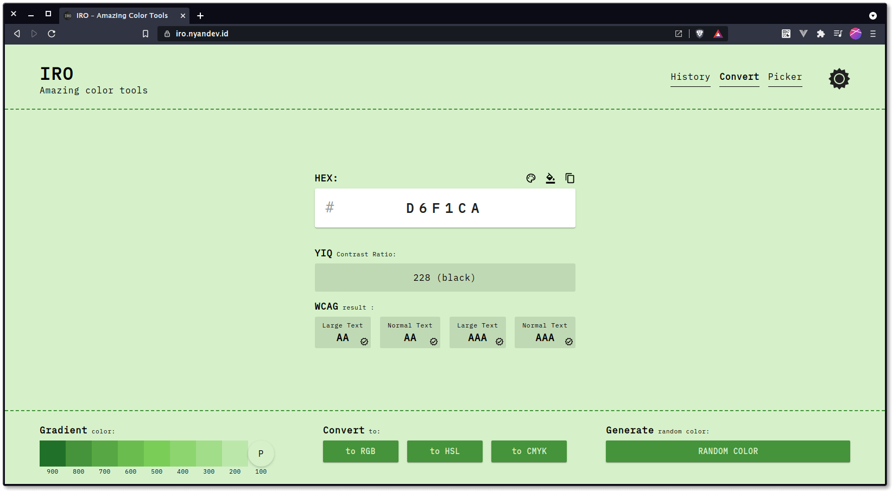
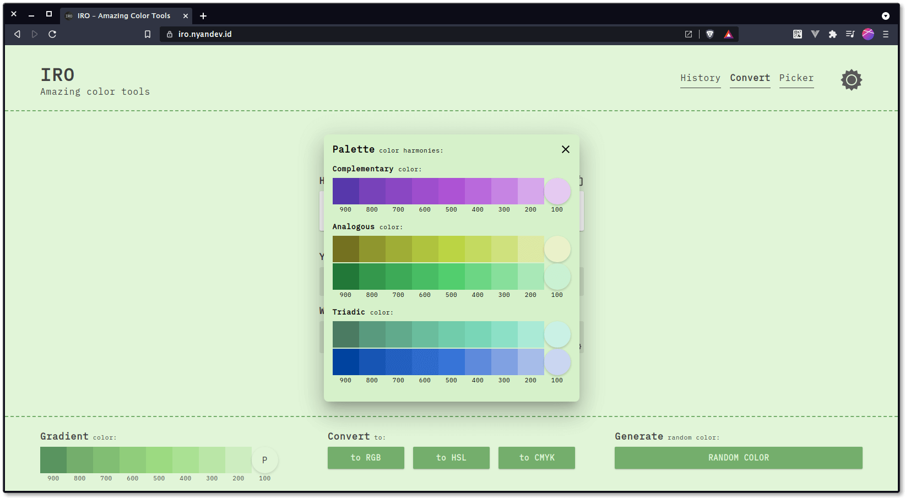
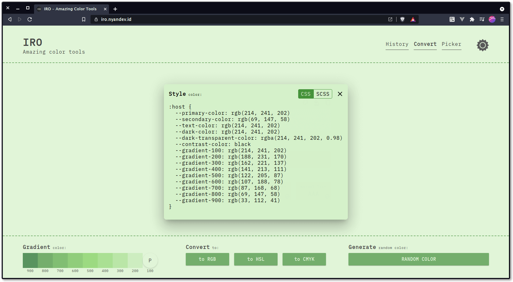

<p align="center" style="text-align:center;">
    
</p>
<h1 align="center">IRO</h1>
<p align="center">Amazing Color Tools. Build with Vue 3 and Vite.</p>

<div align="center">

[](https://github.com/nyancodeid/iro)


[](https://github.com/nyancodeid/iro/issues)
[](https://app.fossa.com/projects/git%2Bgithub.com%2Fnyancodeid%2Firo?ref=badge_shield)

</div>

## Description
IRO (色 / iro / color) is a web-based application that has the main feature to find out the color of several color formats for example HEX, RGB, HSL, and CMYK. Not only that, but IRO also has a feature that can find out the color code of objects or other colored things around through a cellphone camera or even a laptop.

## Tech
IRO build with Latest Web Technology that makes us can access this app even in offline mode (cache-first). And the other cool thing is PWA (Progressive Web App) makes this app installable on Android devices, allow us to use this app to run natively on an Android.

| Tools       | Version         | Desc                                                                                    | Website                                                                                    |
| ----------- | --------------- | --------------------------------------------------------------------------------------- | ------------------------------------------------------------------------------------------ |
| Vue         | `^3.0.5`        | Web Framework                                                                           | [https://v3.vuejs.org/](https://v3.vuejs.org/)                                             |
| Vite        | `^2.3.7`        | Next Generation Frontend Tooling                                                        | [https://vitejs.dev/](https://vitejs.dev/)                                                 |
| Pinia       | `^2.0.0-beta.3` | Intuitive, type safe and flexible Store for Vue                                         | [https://pinia.esm.dev/](https://pinia.esm.dev/)                                           |
| Vue-Router  | `^4.0.8`        | The official router for Vue.js.                                                         | [https://router.vuejs.org/](https://router.vuejs.org/)                                     |
| Matercolors | `^2.2.10`       | A tiny, zero-dependency libary for building harmonious material palettes for any color. | [https://github.com/arvindcheenu/Matercolors](https://github.com/arvindcheenu/Matercolors) |

## Development
```bash
$ npm install
# run dev server
$ npm run dev
# build 
$ npm run build
```

## Screenshot
<p align="center">
  
  
  
</p>


## License
[](https://app.fossa.com/projects/git%2Bgithub.com%2Fnyancodeid%2Firo?ref=badge_large)