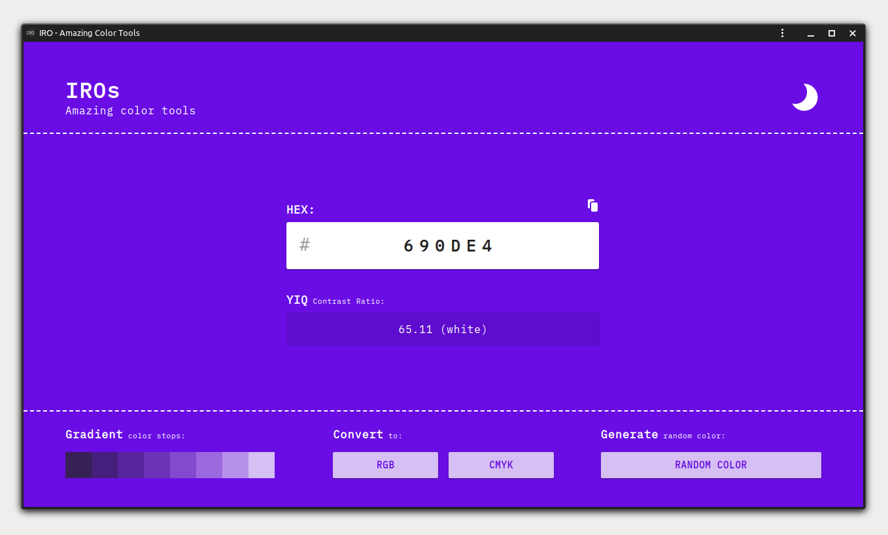

# IRO
amazing color tools. Build with [PreactJS](https://preactjs.com)

[](https://github.com/nyancodeid/iro)

[](https://github.com/nyancodeid/iro/issues)

## Description
This application is only an experimental application. Made just for fun and to learn more about PreactJS.
This application also uses Parcel Bundle

## Run
clone this repository and run using yarn
```
yarn install
yarn run start
```
or using NPM
```
npm install
npm run start
```

## Screenshot
<p align="center">
  
</p>